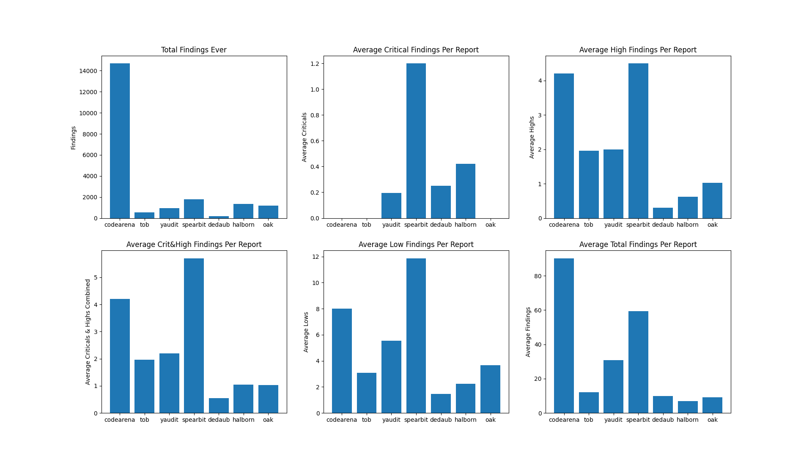

# Masamune-metrics

Generate metrics from Masamune JSON results

## Instructions

1. Download this repository and download the [Masamune](https://github.com/Zellic/masamune) repository
2. Copy the `findings-metrics.py` and `findings-metrics.py` files from this repository into the Masamune repository. Alternatively, copy the `results` directory from the Masamune repository into this directory
3. Run `python3 findings-metrics.py` to generate the text output shown below and to create `result.csv` containing this data
4. Run `python3 findings-metrics.py` to generate charts of the data using the `result.csv` file

## Example output



```
codearena_findings.json
0 Critical findings or 0.0%
685 High findings or 4.66176670749966%
1490 Medium findings or 10.140193276167142%
1305 Low findings or 8.88117599020008%
5720 Gas findings or 38.92745338233293%
4163 Info findings or 28.331291683680412%
1255 Undetermined findings or 8.540901048046821%
76 Unknown findings or 0.517217912072955%
14694 total findings

>>>codearena has 163 unique audits
Average number of findings per audit:
0.0 Critical findings per audit
4.2024539877300615 High findings per audit
9.141104294478527 Medium findings per audit
8.006134969325153 Low findings per audit
35.0920245398773 Gas findings per audit
25.539877300613497 Info findings per audit
7.699386503067485 Undetermined findings per audit
0.4662576687116564 Unknown findings per audit
90.14723926380368 total findings per audit

gitbook_docs.json
0 Critical findings or 0.0%
0 High findings or 0.0%
0 Medium findings or 0.0%
0 Low findings or 0.0%
0 Gas findings or 0.0%
0 Info findings or 0.0%
0 Undetermined findings or 0.0%
259 Unknown findings or 100.0%
259 total findings

>>>gitbook has 259 unique audits
Average number of findings per audit:
0.0 Critical findings per audit
0.0 High findings per audit
0.0 Medium findings per audit
0.0 Low findings per audit
0.0 Gas findings per audit
0.0 Info findings per audit
0.0 Undetermined findings per audit
1.0 Unknown findings per audit
1.0 total findings per audit

immunefi_findings.json
0 Critical findings or 0.0%
0 High findings or 0.0%
0 Medium findings or 0.0%
0 Low findings or 0.0%
0 Gas findings or 0.0%
0 Info findings or 0.0%
0 Undetermined findings or 0.0%
53 Unknown findings or 100.0%
53 total findings

>>>immunefi has 53 unique audits
Average number of findings per audit:
0.0 Critical findings per audit
0.0 High findings per audit
0.0 Medium findings per audit
0.0 Low findings per audit
0.0 Gas findings per audit
0.0 Info findings per audit
0.0 Undetermined findings per audit
1.0 Unknown findings per audit
1.0 total findings per audit

tob_findings.json
0 Critical findings or 0.0%
82 High findings or 15.648854961832061%
99 Medium findings or 18.893129770992367%
127 Low findings or 24.236641221374047%
0 Gas findings or 0.0%
179 Info findings or 34.16030534351145%
37 Undetermined findings or 7.061068702290076%
0 Unknown findings or 0.0%
524 total findings

>>>tob has 44 unique audits
Average number of findings per audit:
0.0 Critical findings per audit
1.8636363636363635 High findings per audit
2.25 Medium findings per audit
2.8863636363636362 Low findings per audit
0.0 Gas findings per audit
4.068181818181818 Info findings per audit
0.8409090909090909 Undetermined findings per audit
0.0 Unknown findings per audit
11.909090909090908 total findings per audit

yaudit_findings.json
6 Critical findings or 0.7009345794392523%
60 High findings or 7.009345794392523%
71 Medium findings or 8.294392523364486%
145 Low findings or 16.939252336448597%
224 Gas findings or 26.16822429906542%
350 Info findings or 40.88785046728972%
0 Undetermined findings or 0.0%
0 Unknown findings or 0.0%
856 total findings

>>>yaudit has 28 unique audits
Average number of findings per audit:
0.21428571428571427 Critical findings per audit
2.142857142857143 High findings per audit
2.5357142857142856 Medium findings per audit
5.178571428571429 Low findings per audit
8.0 Gas findings per audit
12.5 Info findings per audit
0.0 Undetermined findings per audit
0.0 Unknown findings per audit
30.571428571428573 total findings per audit

spearbit_findings.json
36 Critical findings or 2.0190689848569825%
135 High findings or 7.571508693213684%
221 Medium findings or 12.394840157038699%
356 Low findings or 19.966348850252384%
292 Gas findings or 16.376892877173304%
743 Info findings or 41.67134043746495%
0 Undetermined findings or 0.0%
0 Unknown findings or 0.0%
1783 total findings

>>>spearbit has 30 unique audits
Average number of findings per audit:
1.2 Critical findings per audit
4.5 High findings per audit
7.366666666666666 Medium findings per audit
11.866666666666667 Low findings per audit
9.733333333333333 Gas findings per audit
24.766666666666666 Info findings per audit
0.0 Undetermined findings per audit
0.0 Unknown findings per audit
59.43333333333333 total findings per audit

dedaub_findings.json
5 Critical findings or 2.5641025641025643%
6 High findings or 3.076923076923077%
25 Medium findings or 12.820512820512821%
29 Low findings or 14.871794871794872%
0 Gas findings or 0.0%
130 Info findings or 66.66666666666667%
0 Undetermined findings or 0.0%
0 Unknown findings or 0.0%
195 total findings

>>>dedaub has 20 unique audits
Average number of findings per audit:
0.25 Critical findings per audit
0.3 High findings per audit
1.25 Medium findings per audit
1.45 Low findings per audit
0.0 Gas findings per audit
6.5 Info findings per audit
0.0 Undetermined findings per audit
0.0 Unknown findings per audit
9.75 total findings per audit

hacklabs_findings.json
0 Critical findings or 0.0%
0 High findings or 0.0%
0 Medium findings or 0.0%
0 Low findings or 0.0%
0 Gas findings or 0.0%
0 Info findings or 0.0%
0 Undetermined findings or 0.0%
101 Unknown findings or 100.0%
101 total findings

>>>hacklabs has 100 unique audits
Average number of findings per audit:
0.0 Critical findings per audit
0.0 High findings per audit
0.0 Medium findings per audit
0.0 Low findings per audit
0.0 Gas findings per audit
0.0 Info findings per audit
0.0 Undetermined findings per audit
1.01 Unknown findings per audit
1.01 total findings per audit

halborn_findings.json
83 Critical findings or 6.12094395280236%
122 High findings or 8.997050147492626%
248 Medium findings or 18.289085545722713%
440 Low findings or 32.448377581120944%
0 Gas findings or 0.0%
463 Info findings or 34.14454277286136%
0 Undetermined findings or 0.0%
0 Unknown findings or 0.0%
1356 total findings

>>>halborn has 197 unique audits
Average number of findings per audit:
0.4213197969543147 Critical findings per audit
0.6192893401015228 High findings per audit
1.2588832487309645 Medium findings per audit
2.233502538071066 Low findings per audit
0.0 Gas findings per audit
2.350253807106599 Info findings per audit
0.0 Undetermined findings per audit
0.0 Unknown findings per audit
6.883248730964467 total findings per audit

oak_security_findings.json
0 Critical findings or 0.0%
133 High findings or 11.129707112970712%
234 Medium findings or 19.581589958158997%
477 Low findings or 39.9163179916318%
0 Gas findings or 0.0%
351 Info findings or 29.372384937238493%
0 Undetermined findings or 0.0%
0 Unknown findings or 0.0%
1195 total findings

>>>oak has 130 unique audits
Average number of findings per audit:
0.0 Critical findings per audit
1.023076923076923 High findings per audit
1.8 Medium findings per audit
3.669230769230769 Low findings per audit
0.0 Gas findings per audit
2.7 Info findings per audit
0.0 Undetermined findings per audit
0.0 Unknown findings per audit
9.192307692307692 total findings per audit

slowmist_findings.json
25 Critical findings or 6.720430107526882%
23 High findings or 6.182795698924731%
64 Medium findings or 17.204301075268816%
90 Low findings or 24.193548387096776%
0 Gas findings or 0.0%
29 Info findings or 7.795698924731183%
0 Undetermined findings or 0.0%
141 Unknown findings or 37.903225806451616%
372 total findings

>>>slowmist has 64 unique audits
Average number of findings per audit:
0.390625 Critical findings per audit
0.359375 High findings per audit
1.0 Medium findings per audit
1.40625 Low findings per audit
0.0 Gas findings per audit
0.453125 Info findings per audit
0.0 Undetermined findings per audit
2.203125 Unknown findings per audit
5.8125 total findings per audit
```
